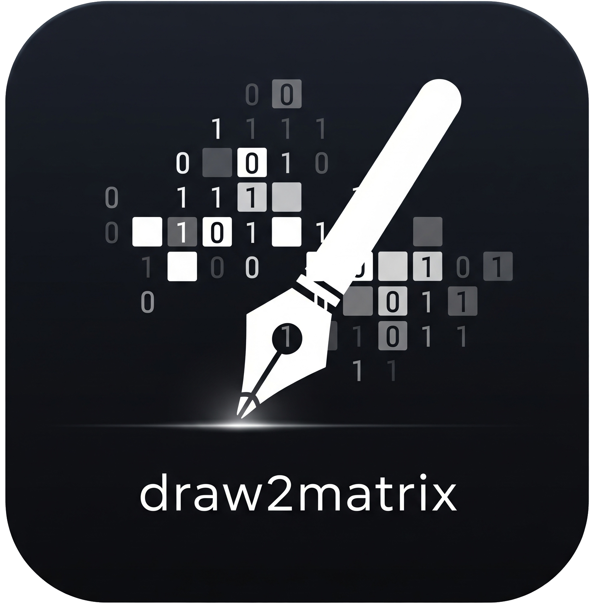

# Draw2Matrix

Draw2Matrix is a drawing application that converts hand-drawn patterns into binary matrices. It provides an intuitive interface for drawing and exporting patterns in various formats, making it useful for machine learning datasets, pattern recognition, and educational purposes.



## Features

- **Interactive Drawing**: Simple and intuitive drawing interface
- **Matrix Conversion**: Automatically converts drawings to binary matrices
- **Multiple Export Formats**:
  - CSV format with optional matrix flattening
  - MATLAB-compatible format
  - PNG image export
- **Customizable Output**:
  - Adjustable matrix dimensions
  - Row/Column-wise flattening options
  - Custom labeling support
- **Theme Support**:
  - Light theme
  - Dark theme
  - Custom purple theme

## Installation

### Prerequisites

- Go 1.22 or later
- Fyne v2.x toolkit

## Usage

1. **Launch the Application**:

   - Run the built executable
   - Or use `go run .` in the project directory

2. **Configure Matrix Settings**:

   - Set the desired number of rows and columns
   - Choose between flat matrix and standard format
   - Enable MATLAB format if needed
   - Click "Save Settings" to confirm

3. **Drawing**:

   - Use your mouse to draw patterns in the white canvas area
   - Click "Clear Paint" to start over

4. **Saving Your Work**:

   - Enter a label for your drawing
   - Choose a save directory
   - Select your preferred format (CSV or MATLAB)
   - Click "Save File" to export

5. **Export Options**:
   - Save as CSV with matrix data
   - Export as MATLAB-compatible format
   - Save as PNG image

## File Formats

### CSV Format

```csv
Input,Target
[1 0 1 0],label
```

### MATLAB Format

Two files are generated:

- `data.txt`: Contains the matrix data in MATLAB matrix format

  ```matlab
  [ 1 0 1 0;
    0 1 0 1;
    1 1 0 0 ]
  ```

- `target.txt`: Contains the corresponding labels in MATLAB array format
  ```matlab
  [ 'A' 'B' 'C' ]
  ```

You can load these files directly in MATLAB using:

```matlab
data = load('data.txt');
target = textread('target.txt', '%s');
```

## Project Structure

- `main.go`: Application entry point and UI setup
- `CustomWidget.go`: Drawing widget implementation
- `ImageTools.go`: Image processing utilities
- `DataTools.go`: Data handling and file operations

## Contributing

1. Fork the repository
2. Create your feature branch (`git checkout -b feature/amazing-feature`)
3. Commit your changes (`git commit -m 'Add some amazing feature'`)
4. Push to the branch (`git push origin feature/amazing-feature`)
5. Open a Pull Request

## License

This project is licensed under the MIT License - see the [LICENSE](LICENSE) file for details.

## Acknowledgments

- [Fyne](https://fyne.io/) - GUI toolkit for Go
- [bild](https://github.com/anthonynsimon/bild) - Image processing library

## Contact

Ehsan Torabi - [Telegram - @ehsan_torabi_frs](https://t.me/ehsan_torabi_frs)

Project Link: [https://github.com/ehsan-torabi/Draw2Matrix](https://github.com/ehsan-torabi/Draw2Matrix)
